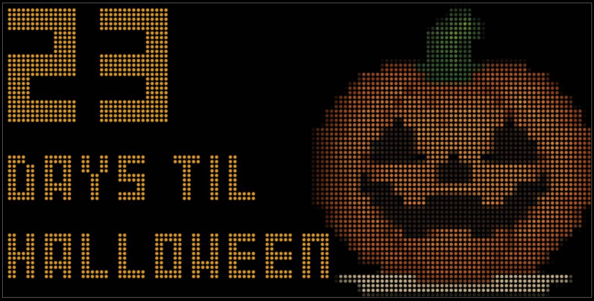
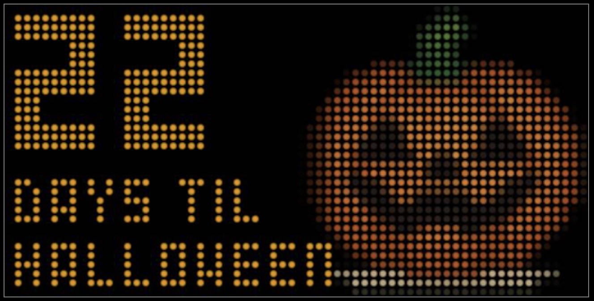

# Holiday Countdown Board

A **Holiday Countdown Board** for the [NHL LED Scoreboard](https://github.com/falkyre/nhl-led-scoreboard) that displays upcoming holidays with customizable colors and images.

It is powered by the [Python `holidays` library](https://github.com/vacanza/holidays) and supports both official holidays and custom user-defined holidays (like birthdays or anniversaries).



## Table of Contents

- [Features](#features)
- [Installation](#installation)
- [Configuration](#configuration)
- [Theming](#theming)
- [Optional Customization](#optional-customization)
- [How It Works](#how-it-works)
- [Screenshots](#screenshots)

---

## Features

- Displays days until the next holiday within a configurable horizon
- Supports country/subdivision selection via the `holidays` library
- Filter by holiday categories (GOVERNMENT, PUBLIC, UNOFFICIAL)
- Ignore specific holidays you don't want to show
- Add **custom holidays** (recurring or fixed-date)
- Apply per-holiday **themes** (foreground color, background color, image)
- Default theme fallback ensures all holidays have consistent styling
- Animated display with gradual text reveal

---

## Installation

1. Use the NHL Led Scoreboard's plugin manager python script to install:

   ```bash
   python plugins.py add https://github.com/kas21/nls-plugin-holiday-countdown-board.git
   ```

2. Make sure the virtual environment for the scoreboard is activated:

   ```bash
   source /home/<pi_user>/nhlsb-venv/bin/activate
   ```

3. Check if the requirements needed for this board are already installed:

   ```bash
   pip list | grep holidays
   ```

4. If requirements are not met, install them:

   ```bash
   pip install -r src/boards/plugins/holiday_countdown_board/requirements.txt
   ```

5. Add `holiday_countdown_board` to your NHL-LED-Scoreboard's main configuration:

   ```bash
   nano config/config.json
   ```

   For example, to add it to the off day rotation:

   ```json
   "states": {
       "off_day": [
           "season_countdown",
           "holiday_countdown_board",
           "team_summary",
           "scoreticker",
           "clock"
       ]
   }
   ```

   **Note:** You must restart the scoreboard for changes to take effect.

---

## Configuration

To customize the `holiday_countdown_board` configuration, copy the sample config to config.json and edit it.

```bash
cp config.sample.json config.json
nano config.json
```

**Note:** You must restart the scoreboard for changes to take effect.

### Config Fields

- `country_code` → Two-letter country code (e.g., `"US"`, `"CA"`, `"GB"`)
- `subdiv` → Optional subdivision/state code (e.g., `"NY"`, `"CA"`)
- `categories` → List of holiday categories to include: `"GOVERNMENT"`, `"PUBLIC"`, `"UNOFFICIAL"`
- `ignored_holidays` → List of holiday names to skip
- `horizon_days` → How many days ahead to look for upcoming holidays (default: 90)
- `themes_path` → Path to a JSON file defining holiday themes (default: `"holiday_themes.json"`)
- `custom_holidays_path` → Path to a CSV file defining custom holidays (default: `"custom_holidays.csv"`)
- `display_seconds` → Seconds to display each holiday (default: 5)
- `enabled` → Enable or disable the board (default: true)

### Example Configuration

```json
{
    "country_code": "US",
    "subdiv": "NY",
    "categories": ["UNOFFICIAL", "GOVERNMENT"],
    "ignored_holidays": [
        "Columbus Day",
        "Veterans Day"
    ],
    "horizon_days": 60,
    "themes_path": "holiday_themes.json",
    "custom_holidays_path": "custom_holidays.csv",
    "display_seconds": 6,
    "enabled": true
}
```
  
---

## Theming

Holiday appearance is controlled by a themes JSON file (default: `holiday_themes.json`).

- Keys are holiday names (case-insensitive, whitespace normalized)
- Each entry can define:
  - `fg` → Foreground/text color (hex format)
  - `bg` → Background color (hex format, currently not rendered)
  - `image` → Path to holiday image (relative to board directory or absolute)
- A `"default"` theme must exist as fallback

### Example `holiday_themes.json`

```json
{
    "default": {
        "fg": "#FFFFFF",
        "bg": "#000000",
        "image": "assets/images/default.png"
    },
    "Valentine's Day": {
        "fg": "#FFB7C5",
        "bg": "#A80030",
        "image": "assets/images/valentines.png"
    },
    "Halloween": {
        "fg": "#FFA500",
        "bg": "#000000",
        "image": "assets/images/halloween.png"
    }
}
```

---

## Optional Customization

To customize the `holiday_countdown_board`, copy the sample files to create your own configuration:

```bash
cd src/boards/plugins/holiday_countdown_board
cp custom_holidays_sample.csv custom_holidays.csv
nano custom_holidays.csv
```

:warning:
**Important:** At this time, `assets/images` is not backedup/restored when the plugin updates.  Images and other files added to this directory will not be preserved.  Any files added to `data` in the root of the plugin folder (you will have to create the directory) will be preserved.  If you wish to add your own images for holidays, please add them here and reference them currectly in `custom_holidays.csv`

**Note:** You must restart the scoreboard for changes to take effect.

---

## How It Works

1. The board fetches official holidays from the `holidays` library based on your country and subdivision
2. Custom holidays from the CSV file are loaded and merged with official holidays
3. Holidays within the configured horizon are sorted by date
4. For each holiday, the board:
   - Displays the holiday image (if configured)
   - Shows a gradient overlay
   - Animates text showing days until the holiday
   - Displays "DAYS TIL" text
   - Shows the holiday name
5. Ignored holidays are skipped during rendering

---

## Screenshots

### 64x32 Display



### 128x64 Display


